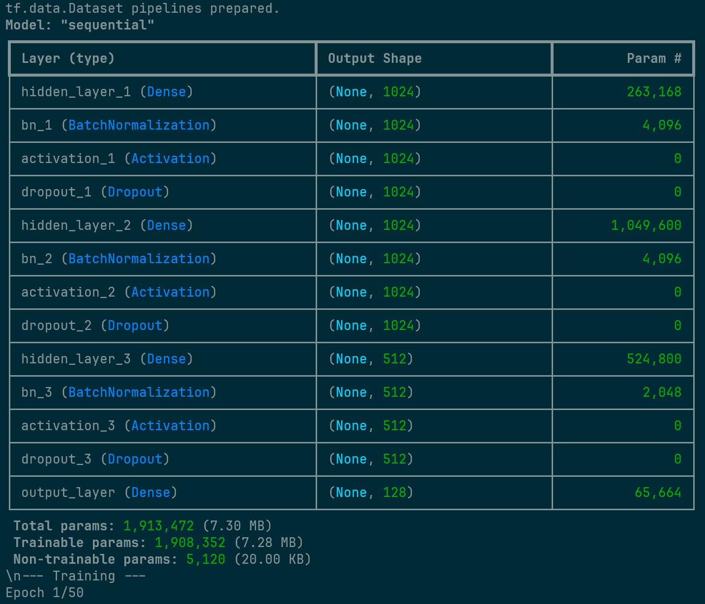
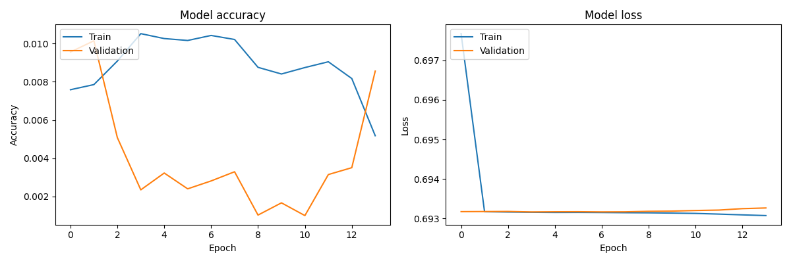
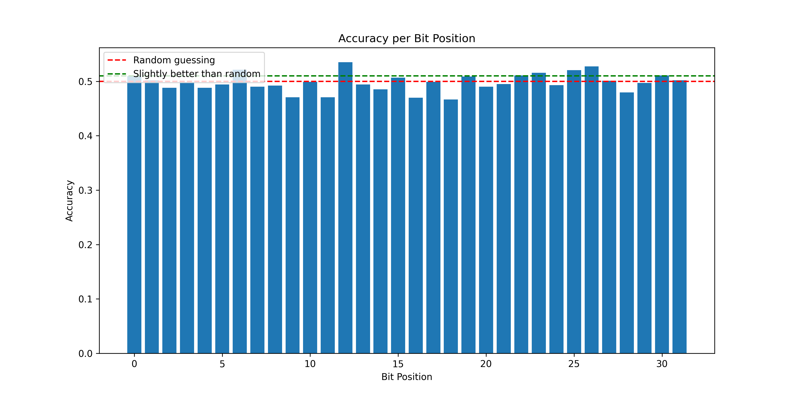

# Initial Report: Neural Network for AES Encryption Learning

**Date:** May 17, 2025

## 1. Goal

The primary objective of this experiment is to develop and train a neural network using TensorFlow and Python to learn the Advanced Encryption Standard (AES) encryption function. This involved:
1.  Generating a dataset of plaintext, key, and corresponding ciphertext tuples.
2.  Defining multiple neural network model (Multi-Layer Perceptron, Transformer, Hybrid, etc).
3.  Experimenting with different optimizations.
4.  Training the model on the generated dataset.
5.  Evaluating the model's performance in predicting ciphertexts.
6.  Utilizing CUDA and a NVIDIA 3070 GPU for acceleration for efficient training.

## 2. Process and Walkthrough

The experiment has progressed through several stages, with a significant focus on environment setup and troubleshooting GPU compatibility for TensorFlow. We begin with a simple MLP setup and a small data set.

### Data Generation:
```python
def generate_sample():
key = np.random.bytes(16)
plaintext = np.random.bytes(16)
cipher = AES.new(key, AES.MODE_ECB)
ciphertext = cipher.encrypt(plaintext)
return np.unpackbits(np.frombuffer(plaintext, dtype=np.uint8)),
np.unpackbits(np.frombuffer(key, dtype=np.uint8)),
np.unpackbits(np.frombuffer(ciphertext, dtype=np.uint8))
```
### Model:

```python
    model = keras.Sequential([
        layers.Input(shape=input_shape, name="input_layer"),
        
        layers.Dense(1024, name="hidden_layer_1"),
        layers.BatchNormalization(name="bn_1"),
        layers.Activation('relu', name="activation_1"),
        layers.Dropout(0.3, name="dropout_1"), # Dropout rate of 30%
        
        layers.Dense(1024, name="hidden_layer_2"),
        layers.BatchNormalization(name="bn_2"),
        layers.Activation('relu', name="activation_2"),
        layers.Dropout(0.3, name="dropout_2"),
        
        layers.Dense(512, name="hidden_layer_3"), # Added a third, slightly smaller hidden layer
        layers.BatchNormalization(name="bn_3"),
        layers.Activation('relu', name="activation_3"),
        layers.Dropout(0.3, name="dropout_3"),
        
        layers.Dense(output_shape, activation='sigmoid', name="output_layer")
    ])
    
    model.compile(optimizer='adam',
                  loss='binary_crossentropy',
                  metrics=['accuracy']) # 'accuracy' here is bitwise accuracy
    return model
```


1. Initial model was a Keras Sequential with 2 hidden layers (1024 units each, ReLU), a smaller hidden layer (512 units, ReLU), and an output layer (128 units, sigmoid). Also added Batch Normalization and Dropout. 
2. For training, I used the Adam optimizer and binary cross-entropy loss, also stopping early if enough epochs went by without a drop in validation loss.
3. Concerning reproducibility, random seeds were set for numpy and tensorflow. 

### It should be noted that results of any consequence were not expected with a dataset this small, using a simple MLP setup. 

## Initial Results



```
accuracy: 9.2557e-04 - auc: 0.5004 - loss: 0.6934 - precision: 0.5004 - recall: 0.4524
```

- As we can see, the model is essentially unable to predict anything higher 50%
- We may as well be flipping a coin, with zero bits predicted correctly.
- In the next iteration, we will use AI to optimize and create a transformer model.

## Updating the model

- We now have a choice of 4 architectures (CNN, Dense, Transformer, and Hybrid)
- We will also reduce the problem size by trying to predict only the first 32 bits instead of all 128.

Without going into the optimizations in the program itself such as sample creation, callback, model caching, and GPU utilization here are the basic parameters:

```python
# Configuration parameters
NUM_SAMPLES = 1000000  # 1M samples
EPOCHS = 100
BATCH_SIZE = 512  # Optimized for RTX 3070
MIXED_PRECISION = True
LEARNING_RATE = 2e-3
MODEL_TYPE = "transformer"  # Options: "dense", "cnn", "transformer", "hybrid"
XLA_ACCELERATION = True
MAX_BITS_TO_PREDICT = 32
MODEL_COMPLEXITY = "ultra"  # Options: "normal", "high", "ultra"
```

You may also look at the python files to examine the models individually.

## Transformer Model




Once again, we can see that we are no better than a coin toss. This isn't exactly a failure and, in fact, just shows the robust and secure nature of AES. These results are exactly what would be expected in an initial experiement.

Further Research

1. **Focus on Specific AES Components**: Target specific AES operations (SubBytes, ShiftRows, etc.) instead of the entire encryption process

2. **Reduce Problem Scope**: Try predicting even fewer bits (8 or 16) to further concentrate learning capacity

3. **Explore Adversarial Approaches**: Implement a GAN-like architecture with competing networks

4. **Analyze Round Keys**: Focus on the key expansion algorithm which might have more learnable patterns

5. **Compute Correlation Analysis**: Add mutual information calculations between input bits and output bits


