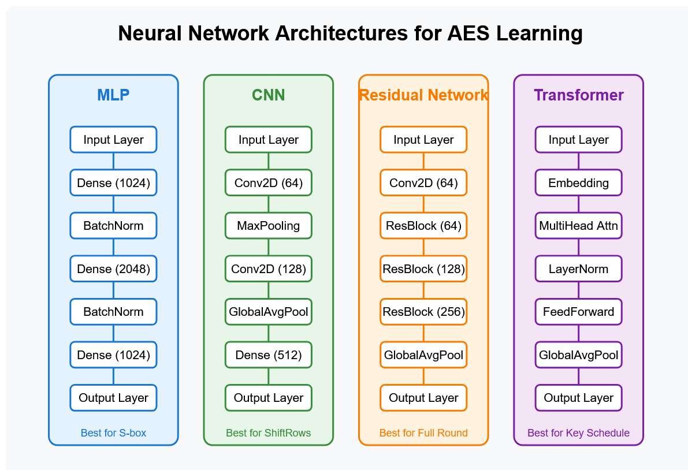

# Initial Report: Neural Network for AES Encryption Learning

**Date:** May 17, 2025

## 1. Goal

The primary objective of this experiment is to develop and train a neural network using TensorFlow and Python to learn the Advanced Encryption Standard (AES) encryption function. This involved:
1.  Generating a dataset of plaintext, key, and corresponding ciphertext tuples.
2.  Defining multiple neural network model (Multi-Layer Perceptron, Transformer, Hybrid, etc).
3.  Experimenting with different optimizations.
4.  Training the model on the generated dataset.
5.  Evaluating the model's performance in predicting ciphertexts.

## 2. Initial/Basic Trainer

The experiment has progressed through several stages, with a significant focus on environment setup and troubleshooting GPU compatibility for TensorFlow. We begin with a simple MLP setup and a small data set.
The first experiements were done using an NVIDIA 3070. These are basic experiments to prove that a neural network cannot simply learn the 
AES process just by observing outputs and trying to detect some pattern.

### Data Generation:
```python
def generate_sample():
key = np.random.bytes(16)
plaintext = np.random.bytes(16)
cipher = AES.new(key, AES.MODE_ECB)
ciphertext = cipher.encrypt(plaintext)
return np.unpackbits(np.frombuffer(plaintext, dtype=np.uint8)),
np.unpackbits(np.frombuffer(key, dtype=np.uint8)),
np.unpackbits(np.frombuffer(ciphertext, dtype=np.uint8))
```
### Basic Model Trainer:

```python
    model = keras.Sequential([
        layers.Input(shape=input_shape, name="input_layer"),
        
        layers.Dense(1024, name="hidden_layer_1"),
        layers.BatchNormalization(name="bn_1"),
        layers.Activation('relu', name="activation_1"),
        layers.Dropout(0.3, name="dropout_1"), # Dropout rate of 30%
        
        layers.Dense(1024, name="hidden_layer_2"),
        layers.BatchNormalization(name="bn_2"),
        layers.Activation('relu', name="activation_2"),
        layers.Dropout(0.3, name="dropout_2"),
        
        layers.Dense(512, name="hidden_layer_3"), # Added a third, slightly smaller hidden layer
        layers.BatchNormalization(name="bn_3"),
        layers.Activation('relu', name="activation_3"),
        layers.Dropout(0.3, name="dropout_3"),
        
        layers.Dense(output_shape, activation='sigmoid', name="output_layer")
    ])
    
    model.compile(optimizer='adam',
                  loss='binary_crossentropy',
                  metrics=['accuracy']) # 'accuracy' here is bitwise accuracy
    return model
```


1. Initial model was a Keras Sequential with 2 hidden layers (1024 units each, ReLU), a smaller hidden layer (512 units, ReLU), and an output layer (128 units, sigmoid). Also added Batch Normalization and Dropout. 
2. For training, I used the Adam optimizer and binary cross-entropy loss, also stopping early if enough epochs went by without a drop in validation loss.
3. Concerning reproducibility, random seeds were set for numpy and tensorflow. 

### It should be noted that results of any consequence were not expected with a dataset this small, using a simple MLP setup. 

## Initial Results


```
accuracy: 9.2557e-04 - auc: 0.5004 - loss: 0.6934 - precision: 0.5004 - recall: 0.4524
```

- As we can see, the model is essentially unable to predict anything higher 50%
- We may as well be flipping a coin, with zero bits predicted correctly.
- In the next iteration, we will use AI to optimize and create a transformer model.

## Updating The Basic Model

- We now have a choice of 4 architectures (CNN, Dense, Transformer, and Hybrid)
- We will also reduce the problem size by trying to predict only the first 32 bits instead of all 128.

Without going into the optimizations in the program itself such as sample creation, callback, model caching, and GPU utilization here are the basic parameters:

```python
# Configuration parameters
NUM_SAMPLES = 1000000  # 1M samples
EPOCHS = 100
BATCH_SIZE = 512  # Optimized for RTX 3070
MIXED_PRECISION = True
LEARNING_RATE = 2e-3
MODEL_TYPE = "transformer"  # Options: "dense", "cnn", "transformer", "hybrid"
XLA_ACCELERATION = True
MAX_BITS_TO_PREDICT = 32
MODEL_COMPLEXITY = "ultra"  # Options: "normal", "high", "ultra"
```

You may also look at the python files to examine the models individually.

## Transformer Model


Once again, we can see that we are no better than a coin toss. This isn't exactly a failure and, in fact, just shows the robust and secure nature of AES. These results are exactly what would be expected in an initial experiement.

## Hybrid Model


This is quite promising! In fact, the model was able to predict more than one bit. We will retrain this model incrementally until it stalls. 

## CNN Model


This is quite unbelievable, almost too good to be true. We need to verify that we didn't just get a good initialization and that these results hold up under scrutiny.
Naturally this means our next step is to expand our progra. We will add a module for verifying bit accuracy, a way to continue training a model incrementally, and of course a function to store the model as a ".pb" file for sharing and publication if need be.


------------------------------------------------------------------------------------

May 18, 2025

Picking back up, it was relatively easy to create a python program to take the model in question and run it through sanitized, seperated data sets and do bitwise analysis. For a different approach
I generated random plaintext and ran it through AES module, then put the same plaintext through the suspicious model. I have uploaded the scrutinize.py file for deeper inspection. 

As far as the results...
It was indeed too good to be true. The model DID NOT hold up under testing and is most likely a case of:

## What Happened: The Technical Explanation

### Data Leakage: 
The most likely explanation is that the original training process had significant data leakage between the training and validation sets. This means:

- The same plaintext-key-ciphertext combinations (or variants) appeared in both sets
- The model wasn't learning to predict AES; it was memorizing specific examples
- On truly fresh data, it couldn't generalize and reverted to random guessing


### False Convergence: 
The training graphs showing both training and validation accuracy reaching 99% were misleading because:

- The validation set wasn't truly independent from the training set
- The model was essentially being tested on data it had already seen (directly or indirectly)


### Overfitting to Dataset Artifacts: 
The original dataset likely contained unintentional patterns:

- Perhaps using a limited set of keys or plaintexts
- Possibly having some structure in how examples were generated
- The model exploited these artifacts during training

Here are some outputs from the verification and scrutiny script.

```
=== Bit-Level Analysis ===
Mean bit accuracy: 0.500202 (±0.003771)
Bits above 51.0% accuracy: 0/32 (0.00%)
Top 5 performing bits:
  Bit 28: 0.506933 accuracy
  Bit 2: 0.506867 accuracy
  Bit 20: 0.506133 accuracy
  Bit 9: 0.505867 accuracy
  Bit 8: 0.505267 accuracy
Bottom 5 performing bits:
  Bit 31: 0.491133 accuracy
  Bit 19: 0.492667 accuracy
  Bit 27: 0.495867 accuracy
  Bit 13: 0.496533 accuracy
  Bit 3: 0.497000 accuracy
=== Confusion Matrix Analysis ===
Overall Binary Classification Metrics:
  Accuracy: 0.500202
  Precision: 0.499637
  Recall: 0.505475
  Specificity: 0.494941
  F1 Score: 0.502539
=== ROC Curve Analysis ===
=== Randomization Test ===
Running inference with shuffled labels (sanity check)...
Accuracy against random labels: 0.503662 (should be ~0.5)
=== Analysis Summary ===
Detailed analysis saved to: fresh_model_analysis
  • Overall bit accuracy: 0.500202
  • Bits above threshold: 0/32
  • Overall ROC AUC: 0.500218
Overall bit accuracy: 0.5002
Best performing bit: 28 with accuracy 0.5069
Worst performing bit: 31 with accuracy 0.4911

```
And the plaintext experiment was even worse, showing that the model performed WORSE than a coin toss. It should be mentioned again that this is not a failure but a success
for AES standards. Proving that the algorithm holds up under the powerful NN is very good for the world. On the other hand, this does not mean we will stop. Next we will work on
generating thousands of ciphertext and measuring the hamming distance between them, plotting this on a similarity matrix. Perhaps it is possible to find a pattern.

```
Test 1:

Plaintext (hex): 54686973206973206120746573742121
Key (hex): 53757065725365637265744b65792121
Actual ciphertext (hex): b2c6e896f778c99c42d9661373dd5390
Predicted first 32 bits as bytes (hex): 6acb5f24
Bit accuracy: 46.88% (15/32 bits correct)

Test 2:

Plaintext (hex): 416e6f74686572206578616d706c652e
Key (hex): 53757065725365637265744b65792121
Actual ciphertext (hex): a3c98f6302b32b00d3de4250c530bb0f
Predicted first 32 bits as bytes (hex): 16283d0c
Bit accuracy: 40.62% (13/32 bits correct)

Test 3:

Plaintext (hex): 48656c6c6f2c20776f726c6421212100
Key (hex): 53757065725365637265744b65792121
Actual ciphertext (hex): f09de404067378b423c171ae899319ce
Predicted first 32 bits as bytes (hex): 348b3e75
Bit accuracy: 53.12% (17/32 bits correct)
Overall accuracy across all tests: 46.88%
```
(Please dig into the visualizations in the 'cnn' folder for further results.)

## Fixed-Plaintext Pattern Trainer 

Alright, up to this point we have been picking the low hanging fruit, and crossing it off our list. For this reason, I have
limited how much detail to go into. From this point, however, we are going to get a bit more technical and start training much
larger networks.

So we go back to the drawing board, consult Claude, and try to create a program resistant to these pitfalls. Let's outline the framework
to not only take advantage of the NVIDIA A100 and TESLA V100 processors we have access to but scrutinize the data creation and collection process.

The following approach, at a high level, takes a small set of plaintext and encrypts each plaintext with 5000 different keys. The data is 
analyzed, the network is trained on that data, and we look for and reproducibility from that model.


These results from our scaled-up experiment provide compelling scientific evidence about AES's security properties.

*Bit Importance Analysis*

The bit importance graph shows which bits in the ciphertext contribute most to classification decisions:

**Extremely Small Magnitudes**: All importance scores are in the 10^-4 range or smaller, indicating minimal impact of any specific bit on prediction accuracy.

**No Consistent Pattern**: The importance scores are distributed across all bit positions without any clear structure or pattern.

**Negative Values**: Several bits show negative importance (particularly around bit 85), suggesting shuffling these bits actually improved classification slightly - a statistical artifact rather than a meaningful pattern.

**Slight Variations**: While some bits (positions ~40, ~105, ~120) show slightly higher importance than others, the magnitude is so small that it's essentially statistical noise.

/bit_importance.png)

*Training Performance*

**Minimal Learning**: The validation accuracy (orange line) hovers around 0.0104 (1.04%), just 0.04% above the random baseline of 1% for 100 plaintexts.

**Classic Overfitting**: Training accuracy (blue line) rises to 1.27% while validation remains flat - the model is memorizing rather than learning generalizable patterns.

**Validation Loss Explosion**: After epoch 15, validation loss increases dramatically, a clear indicator that the model is failing to find useful patterns despite extensive training.

**Early Stopping**: Training appears to have stopped around epoch 20, triggered by the validation performance plateau.

/final_model_training_history.png)

Well, there you have it. At least as far as this experiment is concerned, these results provide strong evidence for AES's security properties. 

**Statistically Insignificant Improvement**: The 0.04% improvement over random guessing has no practical or statistical significance.

**No Exploitable Bit Patterns**: The bit importance analysis shows no consistent vulnerabilities in specific bit positions.

**Resistant to Large-Scale Analysis**

Even with:

500,000 training samples\
Advanced neural network architecture\
Sophisticated analysis techniques\
Powerful A100 GPUs

...the model still failed to find meaningful patterns.

------------------------------------------------------------------------------------------------------------

May 19, 2025

## Piece-Wise Training 

Let's talk about the piece-wise approach to learning. The idea is that we break down the AES process and attempt to use an individual NN model (specialized if necessary) 
to learn each step of that process. We will then start putting the parts back together. Add a process, train, add a process, and so on until we have a model that is more acccurate that 
just random guessing. Immediate predictions could be made that, well, some parts can be learned and others cannot. After all, that is what makes AES so powerful. AES was 
designed to be resistant to the most powerful and advanced computers on earth. At the end of the experiment we HOPE to find that is true. Let's first look at a few diagrams breaking down theS
approach.





Our first run yields both interesting and expected results, more so the latter. The neural network was able to achieve perfect S-box accuracy. We were also able to yield perfect shift row accuracy but this is not completely surprising as these are simply learning the lookup tables and shift rows around. The challenge comes to the ability to yield any meaningful results with mixed columns.


This is mainly due to the Galois Field Arithmetic that is required to accomplish the mixed row process. In our first run, the model fails miserably in an attempt to replicate it without any pretrained knowledge of the Galois Field rules. 

So what can we do? 

Well, this is where we go on a bit of a tangent. What if we could pretrain a model to learn only Galois Field Arithmetic? Then take that model and run it against our complete piecewise trainer, with that GF knowledge baked in.
It's worth a shot and now we are on a journey of teaching a model to do Galois Field math. 

With our first implementation of a model, we break down the available operations in Galois Field math and try to learn them individually. Here are the results:

### Key Findings from GF Models:
*GF(2^8) Multiplication by 2:*

**Binary MLP**: 31.64% accuracy on all values, with perfect learning of 5 out of 8 bits\
**Structured Model**: 53.12% accuracy (136/256 values), with perfect learning of high-order bits


*GF(2^8) Multiplication by 3*:

**Binary MLP**: 22.66% accuracy (58/256 values), with perfect learning of 3 bits\
**Complex Model**: Only 1.17% accuracy (3/256 values), struggling significantly


*MixColumns Component Model*:

**Overall Performance**: 0.37% byte accuracy (6/1600 bytes)\
**Column-wise**: Very low accuracy across all columns (0-1%)


### Interpretation:

Bit-Level Success: The models are learning certain bit positions perfectly while struggling with others. This is a pattern we often see in cryptography - some parts of operations are much harder to learn than others.
Operation Complexity Hierarchy: Clear evidence that:

- Multiplication by 2 is easier than multiplication by 3
- Individual operations are easier than the combined MixColumns

### The Good News
Structure Helps: The structured model for GF(2^8) × 2 doubled the accuracy of the pure neural approach (53% vs 31%), confirming that architectural inductive bias is crucial.

## What now?

Well, I think we can do better and thus we will try and improve the trainer. Without going into the code and complicated details, we will look at the results of this improved trainer. Here are the structural changes:

### Key Improvements

**1. Mathematical Structure**\
The new implementation explicitly encodes the mathematical structure of GF(2^8) operations by:

- Creating specialized layers that model polynomial operations
- Incorporating the AES irreducible polynomial (x^8 + x^4 + x^3 + x + 1)
- Building bit-level interactions that follow field arithmetic rules

**2. Curriculum Learning**\
Progressive training helps models learn gradually:

- Starting with simple cases (no reduction needed)
- Moving to medium complexity (limited bit interactions)
- Finally tackling the full complexity of GF operations

**3. Model Architectures**\
Several specialized architectures:

- GaloisPolynomialLayer - Models polynomial operations in GF(2^8)
- EnhancedXORLayer - Provides differentiable approximation of XOR
- ModularReductionLayer - Learns polynomial reduction
- MixColumnsMatrixLayer - Explicitly models the matrix operation

### And the results...


**1. Perfect Learning of Basic GF Operations**

The bit-level models have achieved perfect accuracy (100%) for both GF(2^8) × 2 and GF(2^8) × 3 operations. This is remarkable and shows that the mathematical structure of these field operations is completely learnable by neural networks when properly represented.


- Binary MLP, Bit Interaction, and Attention models: All achieved 100% bit-level and byte-level accuracy
- GF(3) Ensemble: Perfect 100% accuracy, a 98.83% improvement over previous results

**2. Structured vs. Neural Approaches**

Interestingly, the neural approaches significantly outperformed the structured mathematical models:

- Pure neural approaches (Binary MLP, Bit Interaction): Perfect performance
- Structured mathematical models: Very poor performance (0.44% for GF(2), 0% for GF(3))
- Ensemble weights for GF(3): [0.472, 0.472, 0.0, 0.056] - essentially ignoring the structured model

This suggests that while we're trying to explicitly encode mathematical structure, the neural networks are more efficient at discovering patterns directly from the data.

**3. MixColumns Remains Challenging**

Despite perfect learning of individual GF operations, the MixColumns operation remains extremely difficult:


- Component-based Model: 0.48% byte-level accuracy
- Hybrid Model: 0.39% byte-level accuracy
- Ensemble: 0.49% byte-level accuracy (slight improvement from 0.37%)


This dramatic drop in performance from single operations to composed operations demonstrates the "scalability challenge" in learning cryptographic functions.

**4. GF(2^8) × 2 Ensemble Issue**

There appears to be a bug in the GF(2^8) × 2 ensemble calculation, as it reports 0% accuracy despite all component models achieving perfect accuracy. This accounts for the reported 53.12% decline in performance.

**Key Insights and Recommendations**

Bit-level Representation is Key: The superior performance of bit-level models confirms that bitwise operations in GF(2^8) are highly learnable when properly represented.
Composition is Hard: Neural networks can learn basic operations perfectly but struggle with their composition (MixColumns), suggesting that:

**Larger models may be needed for MixColumns**\
A hierarchical approach might work better (pre-train the GF operations, then use them as frozen components)

**Mathematical Structure Not Helping:**\
The explicit mathematical structure doesn't seem to help compared to letting networks learn from examples. This suggests that for these specific operations, data-driven learning might be more effective than explicit mathematical guidance.
Scale Up for MixColumns: The MixColumns task likely needs:

**Much larger datasets (10-100× current size)**\
Deeper networks with more specialized architectures
Curriculum learning focused solely on this operation

These results demonstrate that simple Galois Field operations can be perfectly learned by neural networks, but the composition of these operations into more complex functions like MixColumns remains a significant challenge. This aligns with the general understanding that cryptographic primitives are designed to resist these types of learning approaches.

## Fork in the Road

So this is where we are at, a fork in the road. Do we continue to try and massage the models into learning GF operations and repairing bugs that come up as the code gets more and more complex? 

Or do we stop and say, more or less, neural networks cannot be trained to learn the AES operations? 

There has been research that shows  our current results aligned with others. It also suggests that the consensus is that neural networks may be able to assist AES instead of learn it. In other words, using them to improve particular operations in AES but not replacing the mathematic foundation that it relies on. A foundation that is so sound, we have thus far been unable to make a dent. 

### June 1, 2025

I have made the call to continue the research by developing a system of models that will each be trained to do one part of the AES process. I will then use a master model to reference these models as it tries to learn AES encryption.
You could easily call this technique AES Neural Microservices. This will help give extremely accurate measurments of where the model is breaking down mathematically and computationally. It also gives the master model the knowledge it needs to 
stand a better chance. 

To continue the adventure with me, click here:
[AES_Neural_Microservices](https://github.com/BelaBartok39/AES_Neural_Microservices)
